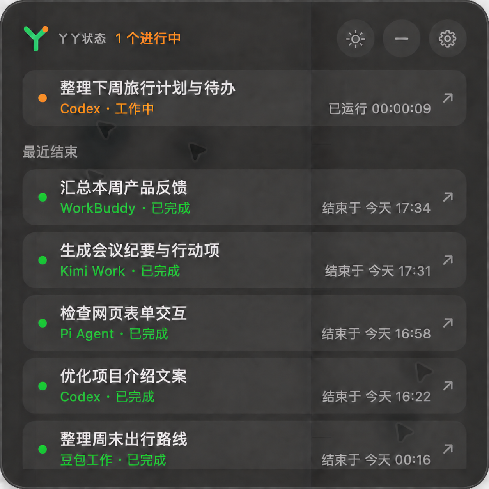

<p align="center">
  
</p>

<h1 align="center">丫丫状态</h1>

<p align="center">
  <strong>AI 任务在跑，状态留在桌面。</strong><br>
  把多个工作台的进行中、等待和结束，汇成一颗可展开的悬浮圆球。
</p>

<p align="center"><sub>macOS 13+ · SwiftUI + AppKit · v0.6.3 · 本地运行</sub></p>

当几个 AI 工作台同时处理任务，你需要随时知道：谁还在工作，哪项在等你操作，刚才又完成了什么。丫丫状态把这些变化放在桌面一角；需要细节时，点开圆球查看任务列表，再跳回支持定位的原会话。

## 一颗圆球，看见任务正在发生什么

<p align="center">
  
</p>

| 圆球信号 | 表示什么 |
| --- | --- |
| 蓝紫到冰蓝的星空流光 | 有任务持续工作超过 3 秒；中央数字显示活动任务数 |
| 静止的橙色圆环 | 当前只有等待操作的活动任务 |
| 绿色勾、灰色停止或红色感叹号 | 观察到任务完成、结束或中断、报错；提示持续约 8 秒 |
| 角落红点 | 某个工作台来源读取失败，可在设置页查看原因 |

圆球约 45 点，可以拖动、收起和重新展开；位置、收起状态及深浅色外观会保留。系统开启“减少动态效果”时，流光保持静止。

## 展开后还能做什么

<p align="center">
  
</p>
<p align="center"><sub>模拟任务列表示意：任务标题与来源均为演示文案</sub></p>

- **看任务**：活动任务置顶，最近结束的任务排在后面；全局列表保留最近 100 条记录，并显示可确认的运行时长或结束时间。
- **回现场**：有明确会话链接时点击卡片返回该任务；只有应用入口的来源会打开应用，并标明无法精确定位会话。
- **查连接**：设置页列出七个来源的连接状态、说明和上次成功读取时间。来源短暂失联时保留已验证的历史记录，过期的活动状态会降为“状态未知”。
- **少打扰**：窗口置于普通窗口上方，可跨桌面空间显示；菜单栏提供显示悬浮窗、刷新全部工作台和退出入口。

当前是本地运行的 macOS 原型。不同工作台提供的状态证据并不相同：能读取会话标题，不代表能判断任务是否还在运行。界面会明确区分已验证状态、状态未知和仅会话记录。

## 支持范围与证据边界

| 来源 | 读取方式 | 目前能确认的范围 | 点击任务 |
| --- | --- | --- | --- |
| Codex | 本机 app-server 与任务状态索引 | 工作中、完成、中断、报错及未知；结束类别由本地状态记录判断 | 对应 Codex 任务 |
| WorkBuddy | 本机会话库；可选生命周期 Hook | 历史会话与已存状态可读；实时工作、等待及结束事件依赖 Hook，真实新任务回调仍需验证 | 对应会话 |
| Kimi Work | 只读会话 SQLite 与运行时事件文件 | 会话与可识别的运行、结束事件；长时间静默的任务转为未知 | Kimi 应用，暂不能精确定位会话 |
| 豆包工作 | 内置 doubao-cli，通过本机 CDP 读取 | 最近会话及最新一轮的工作、等待、完成、失败或取消状态；依赖客户端与连接器格式 | 对应会话 |
| Grok Bot | 本机 Bot 目录快照 | 仅会话；快照无法证明云端任务正在运行或已经结束 | Grok Bot 应用 |
| Pi Agent | 本地 JSONL 会话；可选 Pi 扩展事件 | 已保存的结束结果；扩展装入后可补充开始、等待与结束事件 | VS Code 工作区，暂不能精确定位终端 |
| DeepSeek 网页 | Chrome 扩展、Native Messaging 与本机状态文件 | 已实现打开标签的会话观察；扩展安装及真实生成信号仍需实测 | 对应网页会话 |

“已接入”指仓库中已有读取器与界面，不保证另一台机器上已安装目标应用、Hook 或浏览器扩展。Grok Bot 的“仅会话”不进入进行中计数；缺少可靠证据的任务显示“状态未知”。

### 状态如何判断

内部统一使用“核对中、工作中、等待操作、已完成、已结束、已中断、报错、状态未知、仅会话”。**只有工作中和等待操作计入活动任务**；未知和仅会话不会被推断为正在工作或已完成。DeepSeek 的“已结束”仅表示观察到生成控件消失，不能区分自然完成和用户中止。

每个来源用稳定任务 ID 去重，再按更新时间汇总。各来源有自己的刷新和失效规则；例如来源长期无法读取时，旧的工作中状态会降为未知，已经确认的结束记录仍保留。圆球的结束提示只响应应用运行期间观察到的活动任务状态变化，启动时已有的历史结束记录不会触发提示。

## 构建与运行

需要 **macOS 13+** 和支持 **Swift 6** 的开发工具。应用本身没有外部 Swift 包依赖；可选的豆包连接器需要本机 **Node.js 22+**。其他工作台来源需要相应客户端或本地数据，缺少时设置页会说明连接条件。

```sh
git clone https://github.com/lizilong0326/YaYaStatus.git
cd YaYaStatus
./scripts/build-app.sh
open "dist/丫丫状态.app"
```

构建脚本执行 release 编译，复制应用资源与内置豆包连接器，生成 `dist/丫丫状态.app` 并使用本机临时签名。此应用未做 Apple 公证，也没有安装包。只检查源码是否能编译时可运行 `swift build`。

首次启动后可以在齿轮设置页查看各工作台的读取状态；菜单栏的“刷新全部工作台”可主动重新检查。打开目标应用或完成下面的可选接入后，状态圆球和任务列表会随读取结果更新。

## 可选接入

以下步骤只在需要对应来源的实时事件时执行。安装脚本会修改用户目录中的目标工具配置；执行前可先阅读脚本。

### WorkBuddy Hook

```sh
python3 scripts/install-workbuddy-hook.py
```

脚本备份并合并 `~/.workbuddy/settings.json` 中的生命周期 Hook，不清除其他 Hook。安装后需要用一次新的真实任务验证事件是否到达。移除本项目处理器可运行 `python3 scripts/uninstall-workbuddy-hook.py`；卸载脚本也会先备份设置。

### Pi Agent 扩展

```sh
python3 scripts/install-pi-extension.py
```

脚本将扩展复制到 `~/.pi/agent/extensions/`，不重启已运行的 Pi。执行 Pi 的 `/reload` 或下次启动后，扩展才会接收实时事件；事件快照保存在 `~/Library/Application Support/YaYaStatus/pi/sessions/`。

### DeepSeek Chrome 扩展

1. 在 Chrome 的 `chrome://extensions` 开启开发者模式，选择“加载已解压的扩展程序”，指定本仓库的 `ChromeExtension/deepseek/`。扩展申请 `chat.deepseek.com` 页面访问与 Native Messaging 权限。
2. 复制 Chrome 显示的扩展 ID，运行 `python3 scripts/install-deepseek-host.py <扩展ID>`，注册本机桥接。
3. 重新加载已打开的 DeepSeek 聊天页，用一次真实生成过程检查“正在生成”信号。

扩展只观察已打开的聊天标签。识别不到明确生成控件时显示“状态未知”；关闭标签后无法继续判断云端任务状态。此接入的代码已完成，但真实生成过程仍待验证。

### 豆包工作

内置连接器通过豆包客户端的本机 CDP 接口读取会话。需要豆包工作以 CDP 模式启动，且本机能找到 Node.js 22+；连接不上时设置页会显示条件。连接器依赖客户端内部接口，客户端更新后可能需要适配。相关研究和本机验证范围见 [接入评估](docs/接入评估.md)。

## 项目结构

| 路径 | 用途 |
| --- | --- |
| `Sources/YaYaStatus/AppDelegate.swift` | 创建悬浮窗、菜单栏，启动各来源与保存窗口位置 |
| `Sources/YaYaStatus/StatusPanelView.swift`、`StatusOrbFace.swift` | 任务面板、设置页、状态圆球与动效 |
| `Sources/YaYaStatus/TaskCollectionStore.swift`、`StatusOrbTransition.swift` | 跨来源任务汇总、状态变化与结束提示 |
| `Sources/YaYaStatus/*StatusStore.swift` | 各工作台的本地读取器及刷新逻辑 |
| `ChromeExtension/deepseek/`、`scripts/` | 浏览器扩展、Hook、安装与应用构建脚本 |
| `Vendor/doubao-cli/` | 随应用打包的豆包连接器源码 |
| `Resources/` | Logo、菜单栏及应用图标、应用信息 |

应用采用 SwiftUI 界面和 AppKit 悬浮面板。各读取器将来源任务转换为统一的 `MonitoredTask`，由 `TaskCollectionStore` 排序和汇总；界面根据任务状态及来源连接状态显示列表、圆球和诊断信息。详细的接入证据与限制见 [开源项目与接入评估](docs/接入评估.md)。

## 本地数据与限制

- Codex、WorkBuddy、Kimi Work、Grok Bot 和 Pi Agent 来源读取各自的本地会话或状态记录；读到标题不代表读到可靠的实时状态。Codex 的完成与中断区分依赖本地任务索引。
- WorkBuddy 与 Pi 的事件文件主要保存会话 ID、状态和时间等元数据。DeepSeek 扩展不采集聊天正文、Cookie 或 API Key。任务列表保留标题、ID、状态、时间及可用的跳转入口。
- `doubao-cli` 会经客户端读取任务树，并可能在 `~/Library/Application Support/YaYaStatus/doubao-cli/turns/` 保存包含请求内容的恢复记录。需要自行管理该本地目录。
- 这是针对当前可访问本地数据格式的原型；目标应用升级、会话格式变化、关闭浏览器标签或未安装可选接入，都会影响可见状态。设置页会标明读取失败或接入条件，不将失联时的旧状态持续当作实时状态。

## 来源与许可

Codex 状态读取代码从已有的 IslandMemo 项目迁移，相关实现最初参考了 MIT 许可的 CodexFloat；仓库还包含修改后的 MIT 许可 `doubao-cli` 源码。归属、上游地址和许可文字见 [THIRD_PARTY_NOTICES.md](THIRD_PARTY_NOTICES.md)。本项目目前没有单独声明开源许可证。
